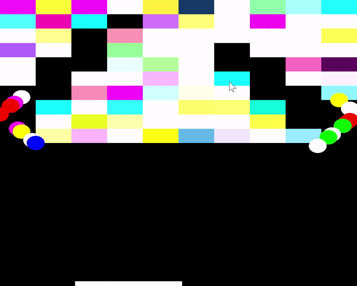

# OpenGL-2D-Rendering-And-Logic
A 2D Brick Breaker Game that Demonstrates Using Classes and Objects to Manage State  

## Overview

The code for the game centers on two main object types:

1. Brick Objects 
2. Ball Objects

Each object has unique states and behaviors:
* Ball objects have unique x and y coordinates as well as horizontal and vertical rate of travel that are updated after  collisions. 

* Brick objects are either reflective or destructable.

All objects are stored in vectors that update as the number of objects increase/decrease. For example, if the ball object array reaches zero, the player has lost and the game ends. If the brick object array reaches zero the player has destroyed all the bricks and won the game. 

## Controls

A: Move Left   D: Move Right   Space: Add More Balls

## Setup

To run this repo on your machine you will need:

1. Visual Studio https://visualstudio.microsoft.com/downloads/
2. OpenGL source code (GLFW) https://www.glfw.org/download.html

Setup a Visual Studio project and clone the source files of this repo into the source directory. Be sure to link the necessary include and libs directories for GLFW to prevent build errors. More details on how to setup GLFW can be found here:
https://www.glfw.org/docs/3.3/quick.html#quick_include